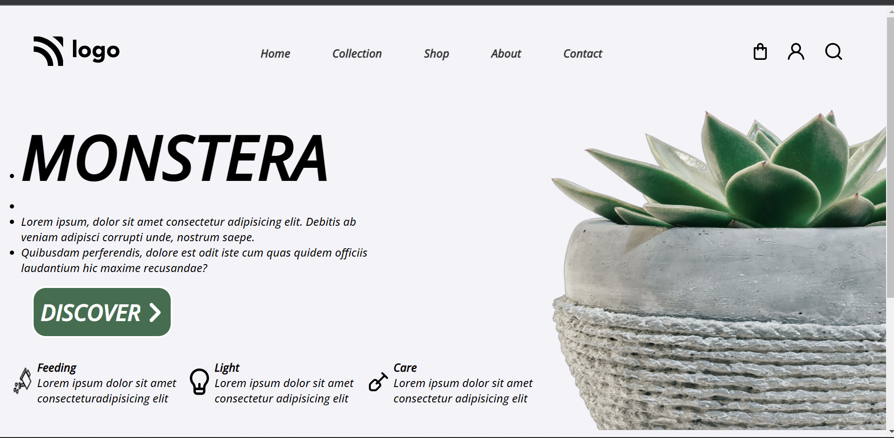

# Project 06 | HTML and CSS | Monstera

By prajwal

---

 

---

## What I learned from this Project

- I learned How to adjust text and image side by side.
- I learned about z-index property
  ## Time required for finishing the peoject
- It takes me near about 6 hours to complete the project.